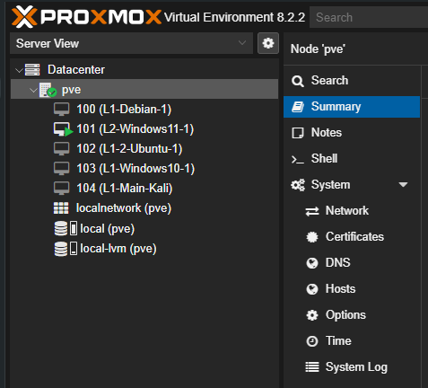
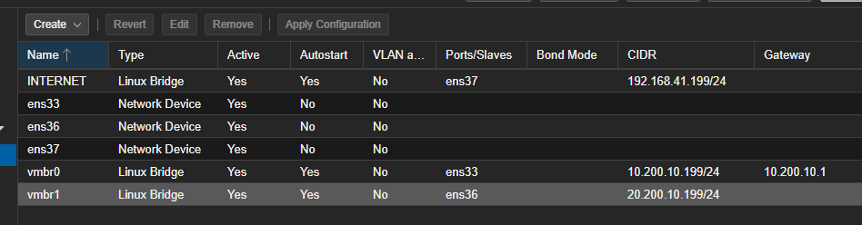
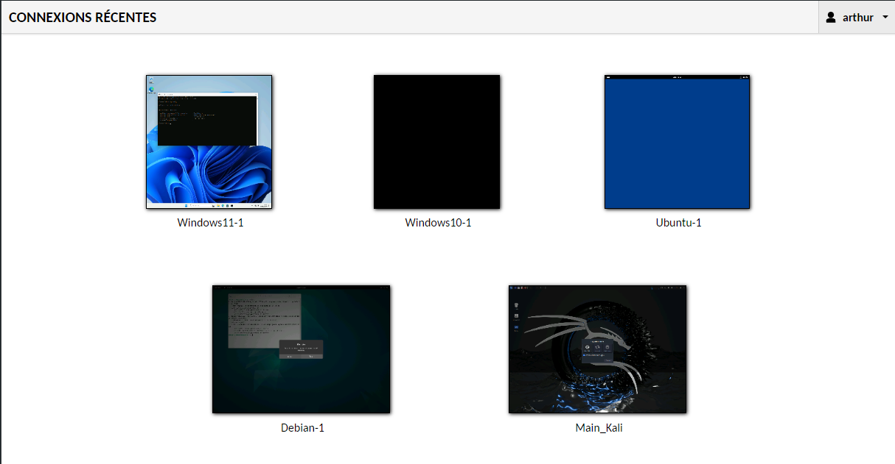

# ECF_Guacamole_AB

- DEBIAN GUACAMOLE - INSTALL SERVEUR :
	- sudo apt-get install build-essential libcairo2-dev libjpeg62-turbo-dev libpng-dev libtool-bin uuid-dev libossp-uuid-dev libavcodec-dev libavformat-dev libavutil-dev libswscale-dev freerdp2-dev libpango1.0-dev libssh2-1-dev libtelnet-dev libvncserver-dev libwebsockets-dev libpulse-dev libssl-dev libvorbis-dev libwebp-dev
	- cd /tmp
	- wget https://downloads.apache.org/guacamole/1.5.2/source/guacamole-server-1.5.2.tar.gz
	- tar -xzf guacamole-server-1.5.2.tar.gz
	- cd guacamole-server-1.5.2/
	- sudo ./configure --with-init-dir=/etc/init.d
	- sudo make
	- sudo make install
	- sudo ldconfig
	- sudo systemctl daemon-reload
	- sudo systemctl start guacd
	- sudo systemctl enable guacd
	- sudo mkdir -p /etc/guacamole/{extensions,lib}
	- echo "deb http://deb.debian.org/debian/ bullseye main" > /etc/apt/sources.list.d/bullseye.list
	- apt update
	- apt install tomcat9 tomcat9-admin tomcat9-common tomcat9-user -y
	- sed -i 's/^/#/' /etc/apt/sources.list.d/bullseye.list
	- cd /tmp
	- wget https://downloads.apache.org/guacamole/1.5.2/binary/guacamole-1.5.2.war
	- sudo mv guacamole-1.5.2.war /var/lib/tomcat9/webapps/guacamole.war
	- sudo systemctl restart tomcat9 guacd
	- sudo apt-get install mariadb-server
	- sudo mysql_secure_installation
	- mysql -u root -p
		- CREATE DATABASE guacadb;
		- CREATE USER 'USER'@'localhost' IDENTIFIED BY 'PASS';
		- GRANT SELECT,INSERT,UPDATE,DELETE ON guacadb.* TO 'USER'@'localhost';
		- FLUSH PRIVILEGES;
		- EXIT;
	- cd /tmp
	- wget https://downloads.apache.org/guacamole/1.5.2/binary/guacamole-auth-jdbc-1.5.2.tar.gz
	- tar -xzf guacamole-auth-jdbc-1.5.2.tar.gz
	- sudo mv guacamole-auth-jdbc-1.5.2/mysql/guacamole-auth-jdbc-mysql-1.5.2.jar /etc/guacamole/extensions/
	- cd /tmp
	- wget https://dev.mysql.com/get/Downloads/Connector-J/mysql-connector-j-8.0.33.tar.gz
	- tar -xzf mysql-connector-j-8.0.33.tar.gz
	- sudo cp mysql-connector-j-8.0.33/mysql-connector-j-8.0.33.jar /etc/guacamole/lib/
	- cd guacamole-auth-jdbc-1.5.2/mysql/schema/
	- cat *.sql | mysql -u root -p guacadb
	- sudo nano /etc/guacamole/guacamole.properties
		  MySQL
			mysql-hostname: 127.0.0.1
			mysql-port: 3306
			mysql-database: guacadb
			mysql-username: USER
			mysql-password: PASS
	- sudo nano /etc/guacamole/guacd.conf
		  [server] 
			bind_host = 0.0.0.0
			bind_port = 4822
	- sudo systemctl restart tomcat9 guacd mariadb

--------------------------------------------------------------------------------

- DEBIAN GUACAMOLE - CONFIG RESEAU :
	- /etc/network/interfaces :
       ```
  		source /etc/network/interfaces.d/*
  		
  		auto lo
  		iface lo inet loopback
  		
  		auto ens33
  		iface ens33 inet dhcp
  		    address 192.168.41.139
  		    netmask 255.255.255.0
  		    gateway 192.168.41.2
  		    dns-nameservers 8.8.8.8 8.8.4.4
  		
  		auto ens36
  		iface ens36 inet static
  		    address 10.200.10.200
  		    netmask 255.255.255.0
	-  Pare feu pour empécher l'accès au réseau local de l'interface ens33 depuis le réseau de l'interface ens36 :
		- sudo apt-get install iptables
		- sudo nano /etc/iptables_rules.sh
    ```
			  	!/bin/bash
				iptables -F
		
				iptables -X
				iptables -t nat -F
				iptables -t nat -X
				iptables -t mangle -F
				iptables -t mangle -X
				
				
				iptables -P INPUT ACCEPT
				iptables -P FORWARD ACCEPT
				iptables -P OUTPUT ACCEPT
				
				
				iptables -A INPUT -i lo -j ACCEPT
				iptables -A OUTPUT -o lo -j ACCEPT
				iptables -A INPUT -d 127.0.0.0/8 -j REJECT
				
				
				iptables -A INPUT -i ens36 -s 10.200.10.0/24 -d 10.200.10.200 -j ACCEPT
				iptables -A OUTPUT -o ens36 -s 10.200.10.200 -d 10.200.10.0/24 -j ACCEPT
				
				
				iptables -A INPUT -i ens36 -s 10.200.10.0/24 -d 192.168.41.137 -j REJECT
				iptables -A OUTPUT -o ens33 -s 192.168.41.137 -d 10.200.10.0/24 -j REJECT
				
				
				iptables -A INPUT -m state --state ESTABLISHED,RELATED -j ACCEPT
				iptables -A OUTPUT -m state --state NEW,ESTABLISHED,RELATED -j ACCEPT
				
				
				iptables -A INPUT -j LOG --log-prefix "iptables-input-denied: " --log-level 7
				iptables -A OUTPUT -j LOG --log-prefix "iptables-output-denied: " --log-level 7
		- sudo chmod +x /etc/iptables_rules.sh
		- sudo /etc/iptables_rules.sh
		- sudo sh -c "iptables-save > /etc/iptables/rules.v4"


- Réseau 0 -> 192.168.41.0/24 (accès internet)
- Réseau 1 -> 10.200.10.0/24
- Réseau 2 -> 10.200.20.0/24

--------------------------------------------------------------------------------

- Installation de Proxmox sur VMware dans le sous réseau 1
- création des sous réseaux relié aux interfaces VMWare
- 

- installation des différentes machines avec client guacamole
- 
	- L1 = Réseau 1 (vmbr0)
	- L2 = Réseau 2 (vmbr1)
- Toutes les adresses ip des machines sont mise en static
- conversion des différentes machines en template pour automatisation via Terraform

--------------------------------------------------------------------------------

- LINUX CLIENT GUACAMOLE
	- apt install openssh-server
	- systemctl start ssh.socket
	- systemctl enable ssh.service
	- apt install xrdp
	- service xrdp start
	- service xrdp-sesman start
	- update-rc.d xrdp enable
	- adduser "USER NAME"
		- juste le nom de l'user dans Full Name
	- usermod -a -G sudo "USER NAME"
	- chsh -s /bin/bash "USER NAME"
	- ensuite sur le site de guacamole :
		- nouvelle connexion
		- protocol : RDP
		- name : nom de la VM
		- hostname : ip de la VM
		- Port : 3389
		- Username : "USER NAME"
		- Password : "MDP ASSOCIÉ"
		- Time zone : Europe - Paris
		- Performance : cocher les 6 premières cases

- WINDOWS CLIENT GUACAMOLE
	- Démarrer  > Paramètres  > Système > Bureau à Distance puis activation du RDP
	- ensuite sur le site de guacamole :
		- nouvelle connexion
		- protocol : RDP
		- name : nom de la VM
		- hostname : ip de la VM
		- Port : 3389
		- Username : "USER NAME" (compte Microsoft)
		- Password : "MDP ASSOCIÉ"
		- Nom de domaine : "MicrosoftAccount"
		- Ignorer le certificat du serveur : Coché
		- Time zone : Europe - Paris
		- Performance : cocher les 6 premières cases

- 

--------------------------------------------------------------------------------

- Terraform avec ProxMox :
	- création des droit TerraformProv :
		- pveum role add TerraformProv -privs "Datastore.Allocate Datastore.AllocateSpace Datastore.Audit Pool.Allocate Sys.Audit Sys.Console Sys.Modify VM.Allocate VM.Audit VM.Clone VM.Config.CDROM VM.Config.Cloudinit VM.Config.CPU VM.Config.Disk VM.Config.HWType VM.Config.Memory VM.Config.Network VM.Config.Options VM.Console VM.Migrate VM.Monitor VM.PowerMgmt SDN.Use"```
	- création de l'utilisateur et attribution des droits:
		- pveum user add terraform-prov@pve --password <password>```
		- pveum aclmod / -user terraform-prov@pve -role TerraformProv```
	- création du token d'identification :
		- pveum user token add terraform-prov@pve terraform-token --privsep=0
		```
  		┌──────────────┬──────────────────────────────────────┐
		│ key          │ value                                │
		╞══════════════╪══════════════════════════════════════╡
		│ full-tokenid │ terraform-prov@pve!terraform-token   │
		├──────────────┼──────────────────────────────────────┤
		│ info         │ {"privsep":"0"}                      │
		├──────────────┼──────────────────────────────────────┤
		│ value        │ XXXXXXXX-XXXX-XXXX-XXXX-XXXXXXXXXXXX │
		└──────────────┴──────────────────────────────────────┘
   		```
	- installation de Terraform sur mon PC (powershell admin) :
		- choco install terraform
	- Création du fichier Terraform.gitignore dans le dossier consacré à Terraform :
		- https://github.com/github/gitignore/blob/main/Terraform.gitignore?ref=tcude.net
	- Création du fichier des variables (variables.tf) : 
		```
		variable "ssh_key" {
		  default = "CLÉ SSH"
		}
		
		variable "virtual_environment_endpoint" {
		  default = "https://10.200.10.199:8006"
		}
		
		variable "virtual_environment_token" {
		  default = "terraform-prov@pve!terraform-token=XXXXXXXX-XXXX-XXXX-XXXX-XXXXXXXXXXXX"
		}
		```
	- Création du fichier provider (provider.tf) : 
		```
				terraform {
		  required_providers {
		    proxmox = {
		      source = "bpg/proxmox"
		      version = "0.60.1"
		    }
		  }
		}
		
		provider "proxmox" {
		  endpoint = var.virtual_environment_endpoint
		  api_token = var.virtual_environment_token
		  insecure = true
		    ssh {
		    agent    = true
		    username = "terraform-prov"
		  }
		}
		```
	- création de fichier principale (main.tf) :
		```
  		resource "proxmox_virtual_environment_vm" "ecf_debian" {
		  name      = "Debian"
		  node_name = "pve"
		
		  clone {
		    vm_id = 100
			full = true
		  }
		}
		
		resource "proxmox_virtual_environment_vm" "ecf_windows11" {
		  name      = "Windows11"
		  node_name = "pve"
		
		  clone {
		    vm_id = 101
			full = true
		  }
		}
		
		resource "proxmox_virtual_environment_vm" "ecf_ubuntu" {
		  name      = "Ubuntu"
		  node_name = "pve"
		
		  clone {
		    vm_id = 102
			full = true
		  }
		}
		
		resource "proxmox_virtual_environment_vm" "ecf_windows10" {
		  name      = "Windows10"
		  node_name = "pve"
		
		  clone {
		    vm_id = 103
			full = true
		  }
		}
		
		resource "proxmox_virtual_environment_vm" "ecf_kali" {
		  name      = "Main_Kali"
		  node_name = "pve"
		
		  clone {
		    vm_id = 104
			full = true
		  }
		}
		```
	- Initialisation de Terraform :
		- ```terraform init``` dans le dossier avec les fichier de configuration terraform via un powershell en admin
	- Création du fichier "plan" pour voir les modification/création qui vont être apporté par Terraform :
		- terraform plan -out plan
		- ```terraform apply plan``` pour appliquer le plan créé

- Pour lancer les VM configuré, il faut utiliser la commande ```terraform apply``` et pour les éteindres ```terraform destroy```

# L'environnement ce lance désormais automatiquement et toutes les machines virtuelles sont utilisable depuis guacamole
